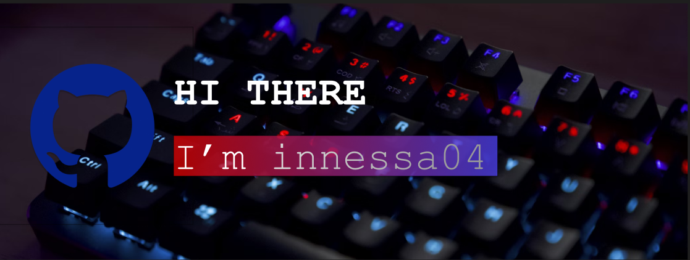

---

# Hi, I'm Innessa04! 👋  

I'm a cybersecurity enthusiast with a focus on **penetration testing** and **network security**, and my other passion is **UI design**. I love exploring new vulnerabilities, securing systems, and designing clean, user-friendly interfaces. In addition to security, I’m also a developer working with **Python**, **C++**, and **JavaScript**.  

## Technologies I use  
- 🛡️ **Cybersecurity & Penetration Testing**: Kali Linux, Metasploit, Burp Suite, Wireshark, Nmap  
- 🌐 **Network Security & Administration**: Cisco (CCNA-level), pfSense, IDS/IPS (Snort, Suricata), VPN, VLANs, Firewalls  
- 🎨 **UI/UX Design**: Figma, Adobe XD, Sketch  
- 🖥️ **Programming Languages**: Python, C++, JavaScript  
- 📚 **Other Tools**: Git, Docker, Linux  

## Get in touch 📧  
- 📧 Email: kiq.art092@gmail.com  

I’m always open to new collaborations, challenges, and opportunities in **cybersecurity, network security, and design**. Let’s connect!  

---

